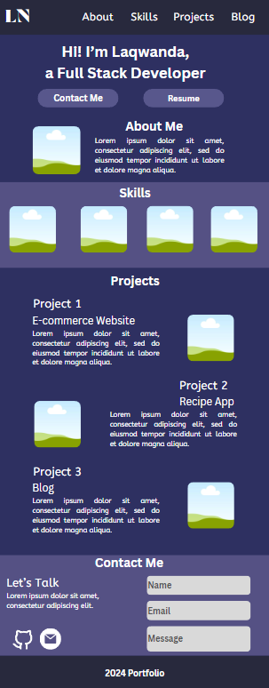

# Portfolio

## Daily Logs

### Day 1:

#### Tasks Completed:

- Initialized a Next.js project.
- Started drafting the wireframe for my portfolio.
- Established the foundation for the following components:
  - Contact
  - Footer
  - Header
  - Hero
  - ProjectCard
  - Projects
  - Skills
  - skillList

#### Challenges and Solutions:

The only challenge I encountered was when implementing React-Bootstrap's carousel for my Skills component. It conflicted with the styling of other components. As a solution, I intend to remove it and explore alternative carousel libraries.

#### Next Steps:

- Resolve the conflict with the carousel in the Skills component.
- Develop an About Me section.
- Initiate styling for the components.

### Day 2:

#### Tasks Completed:

- Completed the wireframe for the Portfolio.
- Explored alternative carousel libraries.
- Added images for the Skills component.
- Established the foundation for the About component.

#### Challenges and Solutions:

Implementing a carousel library posed challenges as I encountered several errors during setup. I experimented with different libraries until finding one that suited my needs.

#### Learnings and Insights:

Discovering various carousel libraries introduced me to TypeScript. I aim to revisit these libraries to delve into TypeScript and enhance my understanding.

#### Next Steps:

- Finalize the development of the Projects component.
- Define a theme and styling for the website.
- Implement functionality for the Contact component.

## Wireframe Screenshot



This is a [Next.js](https://nextjs.org/) project bootstrapped with [`create-next-app`](https://github.com/vercel/next.js/tree/canary/packages/create-next-app).

## Getting Started

First, run the development server:

```bash
npm run dev
# or
yarn dev
# or
pnpm dev
# or
bun dev
```

Open [http://localhost:3000](http://localhost:3000) with your browser to see the result.

You can start editing the page by modifying `app/page.js`. The page auto-updates as you edit the file.
